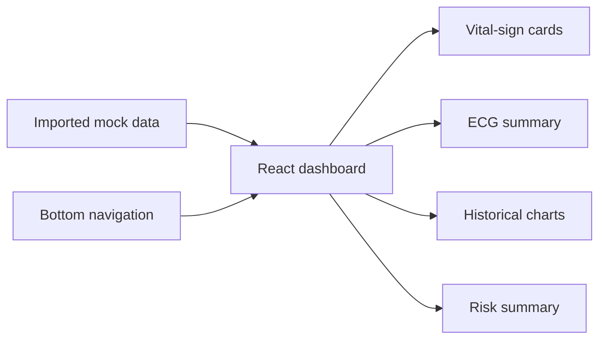

# Cardiac Risk Prediction Dashboard

A React dashboard concept for presenting cardiac and general health indicators in one place. The supplied UI component displays vital-sign cards, ECG information, historical charts, a risk summary, and navigation to history, settings, and emergency-contact views.

## Overview

The dashboard is intended to make health readings and their trends easier to review. Its current UI reads values from an imported mock-data module and passes them to display components. The supplied component does not show data collection from a device, a prediction algorithm, or a backend service.

## Features shown in the UI

- Heart-rate, temperature, and SpO₂ summary cards
- ECG rhythm display and ECG measurement/pattern summary
- Historical charts for heart rate, temperature, and SpO₂
- Risk summary panel displaying a level and confidence value supplied by the data module
- Dashboard, history, settings, and emergency-contact navigation views

The history and settings views are placeholders. The emergency view renders contact buttons; the supplied component does not define their actions.

## Technology

- **UI:** React function component with the `useState` hook
- **Icons:** `lucide-react`
- **Styling:** Utility-style CSS class names in the JSX

## UI data flow



The dashboard selects a visible view using local React state. Values for the dashboard and chart components are imported from `data/mockData`; the UI itself does not calculate a risk score.

## Source component

The component reviewed for this README imports the following project modules:

```text
components/
├── BottomNavigation
├── ECGWave
├── Header
├── HistoricalChart
├── RiskPredictionPanel
└── VitalCard
data/
└── mockData
```

These imported modules and the package/build configuration were not part of the supplied source file.

## Running the project

The supplied component alone is not a complete runnable application. A package manifest, app entry point, imported components, mock-data module, and CSS/build configuration are needed to install and start the UI.

## Scope and limitations

- The supplied component consumes mock data; it does not connect to a wearable or persist readings.
- No model or algorithm implementation is shown for calculating cardiac risk.
- The history and settings screens are placeholders, and the emergency-contact buttons have no actions in the supplied component.
- This UI is not a medical device and should not be used for diagnosis or treatment decisions.
